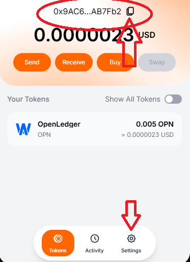
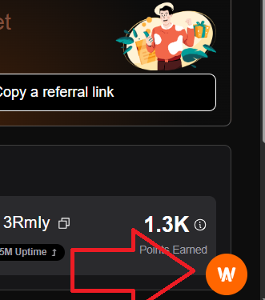
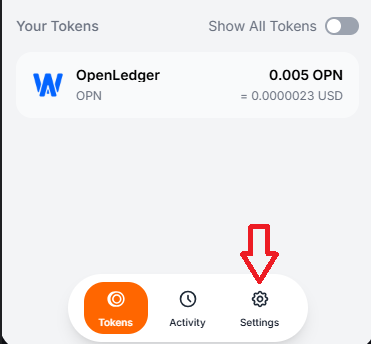
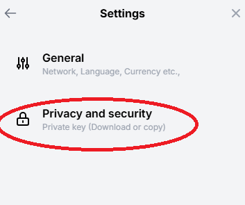
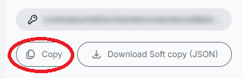

<div align="center">

  <p align="center">
    <a href="https://t.me/cry_batya">
      
    </a>
    <a href="https://t.me/+b0BPbs7V1aE2NDFi">
      
    </a>
  </p>
</div>

## OpenLedger BOT

OpenLedger automation bot for farming daily rewards and maintaining node registration.

- Register Here: [OpenLedger Dashboard](https://testnet.openledger.xyz/?referral_code=md5gz3cwzy)
- Download Extension: [OpenLedger Extension](https://chromewebstore.google.com/detail/openledger-node/ekbbplmjjgoobhdlffmgeokalelnmjjc)

## Features

- Auto Farm & Claim Daily Reward
- Auto Register & Send Heartbeat
- Proxy Support
- Multi-Account Support

## Requirements

- Python 3.9 or higher
- pip (Python package installer)

## Installation

1. **Clone The Repository:**
   ```bash
   git clone https://github.com/TellBip/OpenLedger.git
   ```
   ```bash
   cd OpenLedger
   ```

2. **Install Requirements:**
   ```bash
   pip install -r requirements.txt #or pip3 install -r requirements.txt
   ```

## Configuration

Before running the bot, you need to set up your accounts and proxy information:

1. Create a `data` folder in the project directory if it doesn't exist:
   ```bash
   mkdir -p data
   ```

2. Create an `accounts.json` file in the `data` folder with the following format:
   ```json
   [
       {
           "Address": "your_wallet_address",
           "Access_Token": "your_access_token",
           "Private_Key": "your_private_key_without_0x"
       }
   ]
   ```

3. Create a `proxy.txt` file in the `data` folder with your proxies (one per line):
   ```
   ip:port
   protocol://ip:port
   protocol://user:pass@ip:port
   ```

### How to Get Your Access Token

1. Go to [OpenLedger Testnet](https://testnet.openledger.xyz/?referral_code=md5gz3cwzy)
2. Open your browser's Developer Tools (F12)
3. Go to the Network tab
4. Type "apitn.openledger.xyz" in the search box
5. Look for requests to "me" or other XHR requests
6. Find and copy the "Authorization" header value (this is your access token)


### How to Get Your Wallet Address

Your wallet address can be found in your OpenLedger wallet interface, as shown in the image below (the address circled in red):



### How to Get Your Private Key

Your private key can be found in your wallet settings. **IMPORTANT: Never share your private key with anyone!**

For the bot to work properly, add your private key to the accounts.json file without the "0x" prefix.





## Running the Bot

```bash
python main.py #or python3 main.py
```

Choose "1. Farm & Claim Daily Reward" to start the farming process.

## Telegram http://t.me/+1fc0or8gCHsyNGFi

Thank you for visiting this repository, don't forget to contribute in the form of follows and stars.
If you have questions, find an issue, or have suggestions for improvement, feel free to contact me or open an *issue* in this GitHub repository.
